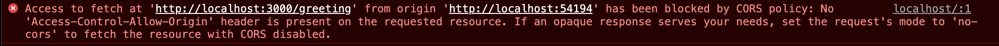

## CORS DEMO

This is a quick demo of how Cross Origin Resource Sharing(CORS) works.

### Backend

Step 1: npm install

Step 2: node index.js

A very simple API server using express.js.  There is a `/greeting` endpoint that will return "Hi".  When accessing this backend from the frontend code initially, the frontend should throw a CORS error in the Browser Developer Console.



This can be fixed by using the [cors](https://www.npmjs.com/package/cors) module, which is already part of the backend.  Just uncomment the line that adds it to the application in the backends `index.js` and restart the backend server.

```
// Comment Out below to enable CORS
// app.use(cors());
```

### Frontend

This is a simple webpage that makes an API call to another domain(the backend server).

To "serve" the page, you can use the [serve](https://www.npmjs.com/package/serve) module by running `npx serve` in the frontend directory.  The host and port will show in the console.

